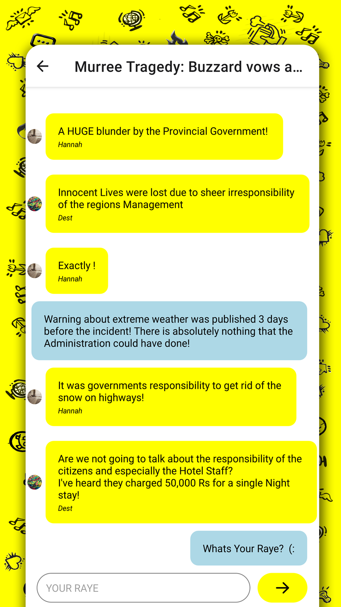
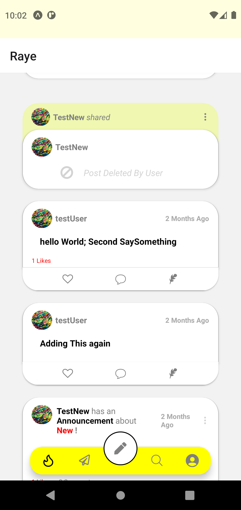
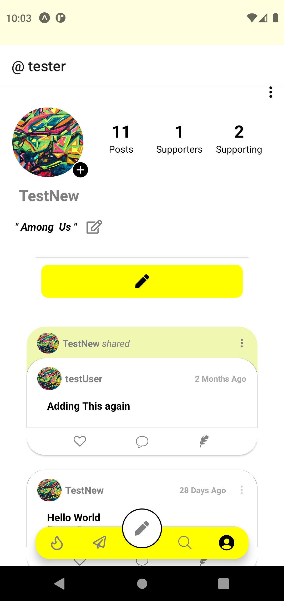

# RAYE: A Global Debates Social Media Platform
A full-stack global debates social media platform built with React Native (front-end) and Node.js, Express.js, MongoDB, and Socket.io (back-end).

### Pictures of MVP:
- Global News Updates
- Discussion Groups

    
    
    
    
    

-----------------------------------------------------------------
### Pictures of 2nd Update:

Featues:
- Main Feed-Page
- Updated Profile Page
- Added Tweets-like Posts 
- Announcement Posts
- Follower Functionality

    
    
    
    
    
    
    

### Features
- Topic Discussions: Engage in discussions on various topics like world affairs within separate groups.
- Profile Posts: Share your opinions on your profile; they appear on your followers' feeds.
- Feed Page: View posts from users you follow in a personalized feed.
- Follower (Supporter) System: Follow others to stay updated on their posts.
- Profile Page: Showcase your bio, profile picture, and personal posts.
- Recommendations: Backend algorithms suggest posts tailored to your interests.

### Usage
- Sign Up/Login: Create an account or log in.
- Update Profile: Add a bio and profile picture.
- Interact: Follow users, join topic groups, and start posting.

### Technologies Used:
- Front-end: React Native
- Back-end: Node.js, Express.js, MongoDB, Socket.io